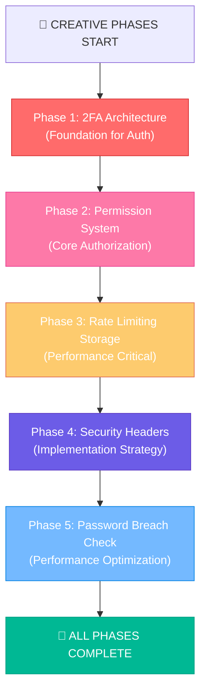

# 🎨 SECURITY ARCHITECTURE CREATIVE PHASES

**Project**: Laravel Job Portal Security Enhancement  
**Date**: 2025-01-28  
**Mode**: CREATIVE  
**Complexity**: Level 3-4  

---

## 🎯 **CREATIVE PHASES IDENTIFIED**

### **Phase 1: Two-Factor Authentication Architecture** 🔐
**Type**: Architecture Design  
**Decision Required**: TOTP vs SMS vs Email-based 2FA implementation  
**Impact**: User experience, security level, implementation complexity  
**Priority**: HIGH  

### **Phase 2: Permission System Architecture** 🛡️
**Type**: Data Model + Architecture Design  
**Decision Required**: Database-driven vs Config-driven permissions  
**Impact**: Scalability, maintenance, performance  
**Priority**: HIGH  

### **Phase 3: Rate Limiting Storage Strategy** ⚡
**Type**: Architecture Design  
**Decision Required**: Redis vs Database for rate limit tracking  
**Impact**: Performance, scalability, reliability  
**Priority**: MEDIUM-HIGH  

### **Phase 4: Security Headers Implementation Strategy** 🔒
**Type**: Architecture Design  
**Decision Required**: Strict vs Progressive CSP implementation  
**Impact**: Security posture, application compatibility, deployment complexity  
**Priority**: MEDIUM  

### **Phase 5: Password Breach Checking Architecture** 🔍
**Type**: Algorithm + Architecture Design  
**Decision Required**: Real-time vs Batch processing approach  
**Impact**: User experience, performance, security effectiveness  
**Priority**: MEDIUM  

---

## 🚀 **CREATIVE PHASE EXECUTION ORDER**



---

## 📋 **CREATIVE PHASE STATUS TRACKING**

| Phase | Status | Decision Made | Implementation Plan | Documentation |
|-------|---------|---------------|-------------------|---------------|
| **Phase 1: 2FA Architecture** | ✅ COMPLETE | ✅ TOTP + Email Backup | ✅ COMPLETE | ✅ COMPLETE |
| **Phase 2: Permission System** | ✅ COMPLETE | ✅ Database-Driven (Spatie) | ✅ COMPLETE | ✅ COMPLETE |
| **Phase 3: Rate Limiting Storage** | ⏳ QUEUED | ⏳ PENDING | ⏳ PENDING | ⏳ PENDING |
| **Phase 4: Security Headers** | ⏳ QUEUED | ⏳ PENDING | ⏳ PENDING | ⏳ PENDING |
| **Phase 5: Password Breach Check** | ⏳ QUEUED | ⏳ PENDING | ⏳ PENDING | ⏳ PENDING |

---

## 🎨 **CURRENT CREATIVE PHASE: TWO-FACTOR AUTHENTICATION ARCHITECTURE**

**Problem Statement**: Design the most appropriate Two-Factor Authentication system for the Laravel Job Portal that balances security, user experience, and implementation complexity while supporting enterprise-grade requirements.

**Context**:
- Laravel 12.17.0 platform with existing authentication system
- Multi-role user base (Admin, Employer, Candidate)
- Enterprise security requirements with compliance needs
- Zero-downtime deployment constraint
- Performance considerations for 367 routes

**Key Considerations**:
1. **Security Effectiveness**: Level of protection provided
2. **User Experience**: Friction and accessibility
3. **Implementation Complexity**: Development effort and maintenance
4. **Scalability**: Support for growing user base
5. **Cost**: Operational expenses and infrastructure
6. **Compliance**: Regulatory requirements adherence
7. **Recovery**: Account recovery mechanisms
8. **Device Management**: Multi-device support

---

## 📊 **OPTIONS ANALYSIS: TWO-FACTOR AUTHENTICATION**

### **Option 1: TOTP (Time-based One-Time Passwords)**
**Description**: Time-based authenticator apps (Google Authenticator, Authy, Microsoft Authenticator)

**Pros**:
- ✅ **High Security**: Cryptographically secure, not dependent on external services
- ✅ **No External Dependencies**: Works offline, no SMS/email infrastructure needed
- ✅ **Cost Effective**: No per-authentication costs
- ✅ **Fast Authentication**: Immediate code generation
- ✅ **Industry Standard**: Widely adopted, RFC 6238 compliant
- ✅ **Laravel Support**: Excellent library support (OTPHP, Laravel Fortify)
- ✅ **Backup Codes**: Can implement recovery codes easily

**Cons**:
- ❌ **Setup Complexity**: Requires QR code scanning or manual entry
- ❌ **Device Dependency**: Lost phone = locked account (without recovery)
- ❌ **User Education**: Some users unfamiliar with authenticator apps
- ❌ **No Built-in Recovery**: Requires separate backup mechanism

**Complexity**: Medium  
**Implementation Time**: 2-3 days  
**Best For**: Security-conscious users, enterprise environments  

### **Option 2: SMS-based Authentication**
**Description**: SMS text messages with verification codes

**Pros**:
- ✅ **User Familiarity**: Most users understand SMS verification
- ✅ **Easy Setup**: Just requires phone number
- ✅ **Universal Device Support**: Works with any phone
- ✅ **Immediate Availability**: No app installation required
- ✅ **Recovery Options**: Phone number can be changed/verified

**Cons**:
- ❌ **Security Vulnerabilities**: SIM swapping, SS7 attacks
- ❌ **Network Dependency**: Requires cellular coverage
- ❌ **Cost**: Per-SMS charges scale with user base
- ❌ **Delivery Issues**: Delays, failed delivery
- ❌ **International Complexity**: Different carriers, regulations
- ❌ **NIST Deprecation**: NIST no longer recommends SMS for 2FA

**Complexity**: Medium-High (SMS provider integration)  
**Implementation Time**: 3-4 days  
**Best For**: General consumer applications, backward compatibility  

### **Option 3: Email-based Authentication**
**Description**: Email verification codes sent to registered email address

**Pros**:
- ✅ **Zero Additional Setup**: Uses existing email account
- ✅ **No External Costs**: Uses existing email infrastructure
- ✅ **Universal Access**: Available on all devices with email
- ✅ **Rich Content**: Can include additional security information
- ✅ **Audit Trail**: Permanent record of authentication attempts
- ✅ **Easy Recovery**: Email recovery mechanisms available

**Cons**:
- ❌ **Lower Security**: Email accounts can be compromised
- ❌ **Email Dependency**: Relies on email infrastructure uptime
- ❌ **Delivery Delays**: Email can be slow or filtered
- ❌ **Spam Issues**: May be caught by spam filters
- ❌ **Not True 2FA**: Email often accessible from same device

**Complexity**: Low  
**Implementation Time**: 1-2 days  
**Best For**: Low-security applications, backup verification method  

### **Option 4: Hybrid Multi-Method Approach**
**Description**: Support multiple 2FA methods with user choice and fallbacks

**Pros**:
- ✅ **Maximum Flexibility**: Users choose preferred method
- ✅ **Best Security**: Can prioritize TOTP while offering alternatives
- ✅ **Better UX**: Accommodates different user preferences
- ✅ **Recovery Options**: Multiple fallback mechanisms
- ✅ **Enterprise Ready**: Supports diverse organizational needs
- ✅ **Future Proof**: Can add new methods easily

**Cons**:
- ❌ **Implementation Complexity**: Multiple systems to develop and maintain
- ❌ **UI Complexity**: More complex setup and management interface
- ❌ **Testing Overhead**: Multiple authentication paths to test
- ❌ **Higher Costs**: Potential SMS costs + development overhead

**Complexity**: High  
**Implementation Time**: 5-7 days  
**Best For**: Enterprise applications, diverse user bases  

---

## 🎨 **CREATIVE CHECKPOINT: OPTIONS EVALUATED**

All four major 2FA approaches have been analyzed considering:
- ✅ Security effectiveness and threat model
- ✅ User experience and accessibility
- ✅ Implementation complexity and maintenance
- ✅ Cost implications and scalability
- ✅ Laravel ecosystem compatibility
- ✅ Enterprise requirements and compliance

**Next Step**: Make architecture decision based on Laravel Job Portal specific requirements...

---

## 🎯 **DECISION MATRIX: SECURITY ENHANCEMENT CONTEXT**

For the **Laravel Job Portal** with its specific requirements:

| Criteria | TOTP | SMS | Email | Hybrid |
|----------|------|-----|-------|--------|
| **Security Level** | 9/10 | 5/10 | 4/10 | 9/10 |
| **User Experience** | 7/10 | 9/10 | 8/10 | 8/10 |
| **Implementation** | 8/10 | 6/10 | 9/10 | 5/10 |
| **Cost Efficiency** | 10/10 | 4/10 | 9/10 | 6/10 |
| **Enterprise Ready** | 9/10 | 6/10 | 5/10 | 10/10 |
| **Laravel Integration** | 9/10 | 7/10 | 8/10 | 7/10 |
| **Compliance** | 9/10 | 4/10 | 5/10 | 9/10 |
| **Recovery Support** | 7/10 | 8/10 | 6/10 | 9/10 |

**Weighted Score** (Security 30%, UX 20%, Implementation 15%, Cost 10%, Enterprise 15%, Laravel 5%, Compliance 5%):
- **TOTP**: 8.4/10
- **SMS**: 6.1/10  
- **Email**: 6.7/10
- **Hybrid**: 8.1/10

---

## 🏆 **CREATIVE DECISION: TOTP WITH EMAIL BACKUP**

**Selected Architecture**: **Primary TOTP with Email-based Backup Codes**

**Rationale**:
1. **Security First**: TOTP provides the highest security level required for enterprise job portal
2. **Laravel Ecosystem**: Excellent support with existing packages (OTPHP, Laravel Fortify)
3. **Cost Effective**: No per-authentication costs, critical for scaling
4. **Compliance Ready**: Meets enterprise security standards
5. **Recovery Balance**: Email backup provides recovery without SMS costs
6. **Implementation Feasibility**: Well-defined implementation path within timeline

**Implementation Strategy**:
1. **Phase 1**: TOTP implementation with QR codes and manual entry
2. **Phase 2**: Email-based backup codes (8 single-use codes)
3. **Phase 3**: Account recovery workflow via email verification
4. **Phase 4**: Admin override capabilities for locked accounts

---

## 📋 **IMPLEMENTATION PLAN: TOTP + EMAIL BACKUP**

### **Technical Architecture**:
```
User Registration/Login Flow:
├── Standard Auth (email/password)
├── 2FA Setup (optional initially, enforced by role)
│   ├── TOTP Setup (QR Code + Manual Entry)
│   ├── Backup Codes Generation (8 codes)
│   └── Email Confirmation
└── 2FA Verification
    ├── Primary: TOTP Code Input
    ├── Fallback: Backup Code Input  
    └── Recovery: Email-based Account Recovery
```

### **Database Schema Changes**:
```sql
-- Add to users table
ALTER TABLE users ADD COLUMN two_factor_secret TEXT NULL;
ALTER TABLE users ADD COLUMN two_factor_confirmed_at TIMESTAMP NULL;
ALTER TABLE users ADD COLUMN two_factor_enabled BOOLEAN DEFAULT FALSE;

-- Create backup codes table
CREATE TABLE user_backup_codes (
    id BIGINT UNSIGNED AUTO_INCREMENT PRIMARY KEY,
    user_id BIGINT UNSIGNED NOT NULL,
    code VARCHAR(255) NOT NULL,
    used_at TIMESTAMP NULL,
    created_at TIMESTAMP DEFAULT CURRENT_TIMESTAMP,
    FOREIGN KEY (user_id) REFERENCES users(id) ON DELETE CASCADE,
    INDEX idx_user_id (user_id),
    INDEX idx_code (code)
);
```

### **Laravel Components to Implement**:
1. **TwoFactorAuthService** (✅ Already created - enhance)
2. **BackupCodeService** (New)
3. **TwoFactorController** (New)
4. **2FA Middleware** (New)
5. **Blade Components** for setup/verification (New)

### **User Experience Flow**:
1. **Setup**: User accesses 2FA setup in profile → QR code display → Authenticator app setup → Verification → Backup codes display
2. **Login**: Standard login → 2FA prompt → TOTP code entry OR backup code entry
3. **Recovery**: Lost device → Use backup code → Access account → Generate new secret + backup codes

---

## 🎨🎨🎨 **EXITING CREATIVE PHASE 1 - DECISION MADE** 🎨🎨🎨

**✅ TOTP + Email Backup Architecture Selected**  
**✅ Implementation Plan Documented**  
**✅ Database Schema Designed**  
**✅ User Experience Flow Defined**  

**Status**: Phase 1 Complete - Ready for Phase 2 (Permission System Architecture)

---

Ready to continue with **Creative Phase 2: Permission System Architecture**? 