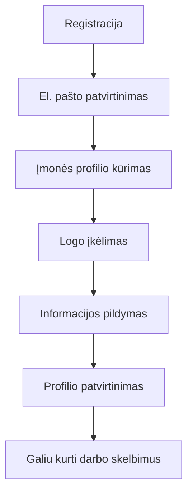
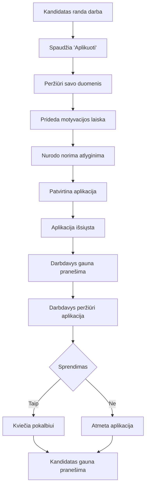
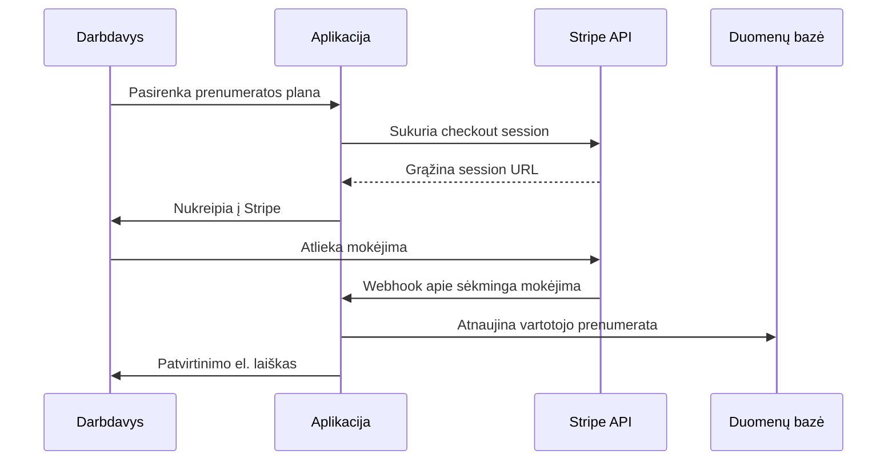

# Vartotojų Scenarijai ir Funkcijų Aprašymai

## 👥 Administratoriaus Scenarijai

### AS-01: Sistemos Valdymas
**Kaip administratorius, noriu valdyti visą sistemą, kad galėčiau užtikrinti sklandų veikimą.**

#### Priėmimo Kriterijai:
- ✅ Galiu peržiūrėti sistemos statistikas realiuoju laiku
- ✅ Galiu valdyti vartotojų paskiras ir roles
- ✅ Galiu stebėti sistemos našumą ir klaidų ataskaitas
- ✅ Galiu konfigūruoti el. pašto nustatymus
- ✅ Galiu valdyti daugiakalbės sistemos nustatymus

#### Detali Specifikacija:
```gherkin
Scenario: Administratorius stebi sistemos statistikas
  Given esu prisijungęs kaip administratorius
  When atidarau dashboard'ą
  Then matau:
    | Metrika | Reikšmė |
    | Aktyvūs vartotojai | 2,847 |
    | Darbo skelbimai | 1,203 |
    | Aplikacijos šiandien | 45 |
    | Servero apkrova | 67% |
    | Atminties naudojimas | 4.2GB/8GB |
```

### AS-02: Turinio Moderavimas
**Kaip administratorius, noriu moderuoti turinį, kad užtikrinčiau kokybę ir atitiktį taisyklėms.**

#### Priėmimo Kriterijai:
- ✅ Galiu peržiūrėti ir aprobuoti naujus darbo skelbimus
- ✅ Galiu blokuoti nepriimtiną turinį
- ✅ Galiu valdyti vartotojų skundus
- ✅ Galiu redaguoti sistemoje esančias kategorijas ir įgūdžius

### AS-03: Finansų Valdymas
**Kaip administratorius, noriu valdyti finansinius aspektus, kad galėčiau stebėti pajamas ir išlaidas.**

#### Priėmimo Kriterijai:
- ✅ Galiu peržiūrėti pajamų ataskaitas
- ✅ Galiu valdyti prenumeratos planus ir kainas
- ✅ Galiu stebėti mokėjimų būsenas
- ✅ Galiu generuoti finansinius reportus

## 🏢 Darbdavio Scenarijai

### DS-01: Įmonės Profilio Sukūrimas
**Kaip darbdavys, noriu sukurti išsamų įmonės profilį, kad pritraukčiau geriausius kandidatus.**

#### Priėmimo Kriterijai:
- ✅ Galiu pridėti įmonės logotipą ir paveikslėlių galeriją
- ✅ Galiu aprašyti įmonės misiją ir vertybes
- ✅ Galiu nurodyti socialinių tinklų nuorodas
- ✅ Galiu pridėti kontaktinę informaciją
- ✅ Galiu nurodyti įmonės dydį ir pramonės šaką

#### Detalus Workflow:


### DS-02: Darbo Skelbimo Kūrimas
**Kaip darbdavys, noriu kurti detalius darbo skelbimus, kad pritraukčiau tinkamus kandidatus.**

#### Priėmimo Kriterijai:
- ✅ Galiu naudoti rich text editorių aprašymui
- ✅ Galiu pridėti reikalaviamus įgūdžius iš sistemos bazės
- ✅ Galiu nustatyti atlyginimo diapazoną ir valiutą
- ✅ Galiu pasirinkti darbo tipą (nuolatinis, laikinas, freelance)
- ✅ Galiu nustatyti aplikacijos galiojimo datą

#### Darbo Skelbimo Forma:
```typescript
interface JobPostForm {
  jobTitle: string;           // max 180 simbolių
  description: string;        // min 100 simbolių
  keyResponsibilities: string;
  jobCategory: number;        // Foreign Key
  jobType: number;           // Foreign Key
  salaryFrom: number;        // min 0, max 999,999,999
  salaryTo: number;          // >= salaryFrom
  currency: number;          // Foreign Key
  salaryPeriod: number;      // Foreign Key (hourly, monthly, yearly)
  location: {
    country: number;         // Foreign Key
    state: number;          // Foreign Key  
    city: number;           // Foreign Key
  };
  experience: number;        // metais, min 0, max 50
  positions: number;         // kiekis, min 1, max 100
  skills: number[];          // masyvas skill ID, min 1, max 10
  expiryDate: Date;         // > šiandienos data
  isFreelance: boolean;
  hideSalary: boolean;
  genderPreference: 0|1|2;  // 0-male, 1-female, 2-both
}
```

### DS-03: Kandidatų Valdymas
**Kaip darbdavys, noriu efektyviai valdyti kandidatų aplikacijas ir CV.**

#### Priėmimo Kriterijai:
- ✅ Galiu peržiūrėti visus aplikavusius kandidatus
- ✅ Galiu filtruoti kandidatus pagal įgūdžius, patirtį, lokaciją
- ✅ Galiu saugoti kandidatus į 'favoritų' sąrašą
- ✅ Galiu siųsti automatizuotus el. laiškus kandidatams
- ✅ Galiu stebėti aplikacijų statusus (nauja, peržiūrėta, interviu, pasamdyta, atmesta)

#### Kandidatų Filtravimo Sistema:
```typescript
interface CandidateFilters {
  skills: number[];          // Įgūdžių ID
  experience: {
    min: number;             // Minimalus patirties laikotarpis
    max: number;             // Maksimalus patirties laikotarpis
  };
  location: {
    country?: number;
    state?: number;
    city?: number;
    radius?: number;         // km spindulys nuo miesto
  };
  salary: {
    min?: number;
    max?: number;
    currency?: number;
  };
  availability: {
    immediatelyAvailable: boolean;
    availableFrom?: Date;
  };
  education: {
    degreeLevel?: number;
    university?: string;
  };
  languages: number[];       // Kalbų ID
}
```

### DS-04: Premium Funkcijos
**Kaip mokantis darbdavys, noriu naudotis premium funkcijomis, kad turėčiau pranašumą.**

#### Priėmimo Kriterijai:
- ✅ Mano darbo skelbimai rodomi viršuje paieškos rezultatų
- ✅ Galiu peržiūrėti išsamesnę kandidatų analitika
- ✅ Galiu naudotis AI pagrįstomis kandidatų rekomendacijomis
- ✅ Turiu prioritetinį klientų aptarnavimą
- ✅ Galiu eksportuoti kandidatų duomenis

## 👤 Kandidato Scenarijai

### KS-01: Profilio Sukūrimas
**Kaip kandidatas, noriu sukurti išsamų profilį, kad darbdaviai galėtų mane lengvai rasti.**

#### Priėmimo Kriterijai:
- ✅ Galiu sukurti profilio CV su skirtingais šablonais
- ✅ Galiu pridėti savo darbo patirtį chronologiškai
- ✅ Galiu pridėti išsilavinimo informaciją
- ✅ Galiu nurodyti savo įgūdžius ir jų lygius
- ✅ Galiu įkelti portfelį ir projektų pavyzdžius
- ✅ Galiu pridėti kalbų žinias

#### CV Struktūra:
```typescript
interface CandidateProfile {
  personalInfo: {
    firstName: string;
    lastName: string;
    email: string;
    phone: string;
    dateOfBirth: Date;
    gender: 0|1;              // 0-male, 1-female
    maritalStatus: number;    // Foreign Key
    location: {
      country: number;
      state: number;
      city: number;
    };
    profileImage?: string;
    socialLinks: {
      linkedin?: string;
      github?: string;
      portfolio?: string;
    };
  };
  
  professional: {
    currentPosition?: string;
    careerLevel: number;      // Foreign Key
    industry: number;         // Foreign Key
    functionalArea: number;   // Foreign Key
    currentSalary?: number;
    expectedSalary: number;
    salaryCurrency: number;
    experienceYears: number;
    immediatelyAvailable: boolean;
    availableFrom?: Date;
  };
  
  experience: Array<{
    id: number;
    company: string;
    position: string;
    startDate: Date;
    endDate?: Date;           // null jei current
    isCurrent: boolean;
    description: string;
    location: string;
  }>;
  
  education: Array<{
    id: number;
    institution: string;
    degree: string;
    degreeLevel: number;      // Foreign Key
    fieldOfStudy: string;
    startDate: Date;
    endDate?: Date;
    grade?: string;
    description?: string;
  }>;
  
  skills: Array<{
    skillId: number;
    proficiencyLevel: 'beginner'|'intermediate'|'advanced'|'expert';
  }>;
  
  languages: Array<{
    languageId: number;
    proficiencyLevel: 'basic'|'conversational'|'fluent'|'native';
  }>;
}
```

### KS-02: Darbo Paieška
**Kaip kandidatas, noriu efektyviai ieškoti man tinkamų darbo vietų.**

#### Priėmimo Kriterijai:
- ✅ Galiu ieškoti pagal raktažodžius darbo pavadinime ir aprašyme
- ✅ Galiu filtruoti pagal lokaciją, atlyginimą, darbo tipą
- ✅ Galiu išsaugoti paieškos kriterijus ateičiai
- ✅ Galiu gauti el. pašto pranešimus apie naujas atitinkančias vakansijas
- ✅ Galiu rūšiuoti rezultatus pagal datą, atlyginimą, relevantiskumą

#### Paieškos Filtrai:
```typescript
interface JobSearchFilters {
  keyword?: string;          // Paieška job_title ir description
  location: {
    country?: number;
    state?: number;
    city?: number;
    remote?: boolean;        // Nuotolinis darbas
  };
  salary: {
    min?: number;
    max?: number;
    currency?: number;
    period?: number;         // hourly, monthly, yearly
  };
  jobType?: number[];        // Darbo tipų ID
  categories?: number[];     // Kategorijų ID
  experience: {
    min?: number;
    max?: number;
  };
  company?: {
    size?: number[];         // Įmonės dydžiai
    industry?: number[];     // Pramonės šakos
  };
  posted: {
    within?: 'day'|'week'|'month';  // Paskelbta per
  };
  workSchedule?: {
    fullTime?: boolean;
    partTime?: boolean;
    freelance?: boolean;
    internship?: boolean;
  };
}
```

### KS-03: Aplikacijų Teikimas
**Kaip kandidatas, noriu lengvai teikti aplikacijas darbams ir sekti jų statusą.**

#### Priėmimo Kriterijai:
- ✅ Galiu aplikuoti vienu paspaudimu naudodamas savo profilio duomenis
- ✅ Galiu pridėti motyvaciją laišką kiekvienai aplikacijai
- ✅ Galiu nurodyti norima atlyginimą konkrečiai pozicijai
- ✅ Galiu sekti aplikacijos statusą (pateikta, peržiūrėta, interviu, atmesta)
- ✅ Galiu gauti pranešimus apie aplikacijos statuso pokyčius

#### Aplikacijos Workflow:


### KS-04: Karjeros Priemonės
**Kaip kandidatas, noriu naudotis papildomomis karjeros priemonėmis.**

#### Priėmimo Kriterijai:
- ✅ Galiu skaityti karjeros patarimus ir straipsnius
- ✅ Galiu lyginti atlyginimus pagal pozicijas ir regionus
- ✅ Galiu dalyvauti įgūdžių testuose
- ✅ Galiu sekti dominančias įmones
- ✅ Galiu gauti personalizuotus darbo pasiūlymus

## 🔄 Sistemos Integracijos Scenarijai

### IS-01: El. Pašto Sistema
**Sistema automatiškai siunčia el. laiškus svarbiems įvykiams.**

#### Automatiniai El. Laiškai:
```typescript
interface EmailTemplates {
  // Autentifikacija
  emailVerification: EmailTemplate;
  passwordReset: EmailTemplate;
  
  // Kandidatams
  applicationConfirmation: EmailTemplate;
  applicationStatusUpdate: EmailTemplate;
  newJobAlert: EmailTemplate;
  interviewInvitation: EmailTemplate;
  
  // Darbdaviams
  newApplicationNotification: EmailTemplate;
  profileViewNotification: EmailTemplate;
  subscriptionExpiry: EmailTemplate;
  
  // Adminams
  newUserRegistration: EmailTemplate;
  paymentReceived: EmailTemplate;
  systemAlert: EmailTemplate;
}

interface EmailTemplate {
  subject: string;
  htmlContent: string;
  textContent: string;
  variables: string[];        // {{name}}, {{job_title}} ir t.t.
  triggerEvent: string;
  isActive: boolean;
  language: string;
}
```

### IS-02: Mokėjimo Sistema
**Sistema integruota su mokėjimo procesoriais saugiam mokėjimų apdorojimui.**

#### Palaikomi Mokėjimo Metodai:
- **Stripe**: Kortelės, Apple Pay, Google Pay
- **PayPal**: PayPal paskira ir kortelės
- **Paystack**: Afrikanųs regionų mokėjimai
- **Banko pavedimai**: Lietuvos ir ES bankai

#### Mokėjimo Workflow:


### IS-03: Failų Valdymo Sistema
**Sistema saugiai tvarko vartotojų įkeliamus failus.**

#### Palaikomi Failų Tipai:
```typescript
interface FileUploadRules {
  resumes: {
    allowedTypes: ['pdf', 'doc', 'docx'];
    maxSize: '10MB';
    naming: 'candidate_id_resume_timestamp.ext';
  };
  companyLogos: {
    allowedTypes: ['jpg', 'jpeg', 'png', 'svg'];
    maxSize: '5MB';
    dimensions: {
      min: '100x100';
      max: '2000x2000';
      recommended: '500x500';
    };
  };
  portfolioFiles: {
    allowedTypes: ['jpg', 'jpeg', 'png', 'pdf', 'zip'];
    maxSize: '20MB';
    maxFiles: 10;
  };
}
```

## 📊 Analitikos ir Ataskaitų Scenarijai

### AS-01: Vartotojų Elgsenos Analizė
**Sistema stebi ir analizuoja vartotojų elgseną optimizavimo tikslams.**

#### Stebimine Metrikos:
```typescript
interface AnalyticsEvents {
  // Pagrindiniai įvykiai
  userRegistration: {
    userType: 'candidate'|'employer';
    source: 'organic'|'google'|'facebook'|'referral';
    country: string;
  };
  
  jobView: {
    jobId: number;
    userId?: number;
    source: 'search'|'featured'|'email'|'direct';
    timeSpent: number;        // sekundėmis
  };
  
  jobApplication: {
    jobId: number;
    candidateId: number;
    applicationTime: number;  // kiek užtruko aplikacijos pildymas
  };
  
  searchPerformed: {
    userId?: number;
    query: string;
    filters: object;
    resultsCount: number;
    clickedResults: number[];
  };
  
  // Konversijos įvykiai
  subscriptionPurchase: {
    userId: number;
    planId: number;
    amount: number;
    currency: string;
    paymentMethod: string;
  };
}
```

### AS-02: Sėkmės Metrikos
**Sistema matuoja pagrindinius sėkmės rodiklius (KPI).**

#### Dashboard Metrikos:
```typescript
interface DashboardMetrics {
  userMetrics: {
    totalUsers: number;
    activeUsers: number;        // paskutinių 30 dienų
    newUsers: number;          // šį mėnesį
    userGrowthRate: number;    // % pokytis
    retentionRate: number;     // % grįžtančių vartotojų
  };
  
  jobMetrics: {
    totalJobs: number;
    activeJobs: number;
    newJobs: number;           // šį mėnesį
    averageJobViews: number;
    averageApplicationsPerJob: number;
  };
  
  financialMetrics: {
    monthlyRevenue: number;
    yearlyRevenue: number;
    averageRevenuePerUser: number;
    churnRate: number;         // % panaikinusių prenumeratą
  };
  
  engagementMetrics: {
    averageSessionDuration: number;  // minutėmis
    bounceRate: number;             // %
    pageViewsPerSession: number;
    searchConversionRate: number;   // % paieškų, kurios baigiasi aplikacija
  };
}
```

---

*Šie vartotojų scenarijai yra pagrindas funkcijų plėtojimui ir testavimui. Jie bus reguliariai atnaujinami pagal vartotojų atsiliepimus ir rinkos poreikius.* 