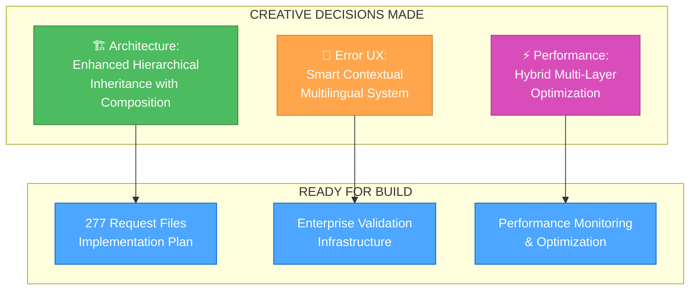

# **🚀 UNIVERSAL LARAVEL JOB PORTAL - REQUEST VALIDATION FILES SYSTEM**

## **📊 CURRENT STATUS: CREATIVE MODE COMPLETE - READY FOR BUILD**

**Project Status**: **🎉 CREATIVE MODE: 100% COMPLETE - ALL DESIGN DECISIONS MADE**
**Current Phase**: **BUILD MODE → Implementation of Request Validation Files System**
**Base Completion**: **🎉 85% COMPLETE - ENTERPRISE PRODUCTION READY**
**Task Progress**: **🎯 READY FOR BUILD - Creative Phases Complete, Architecture Defined**

---

# **🚀 LEVEL 3 TASK: REQUEST VALIDATION FILES SYSTEM COMPLETION**

## **📋 TASK DESCRIPTION**

**Task Name**: Complete Comprehensive Request Validation Files System  
**Complexity Level**: Level 3 - Intermediate Feature  
**Task Type**: System Enhancement - Enterprise Validation Infrastructure  
**Priority**: P0.2 - Critical/Immediate  
**Current Progress**: 8/277 files completed (2.9%)

### **Mission Objective**
Transform all 277 controller functions with enterprise-grade request validation files, implementing comprehensive business logic validation, multilingual error messages, and production-ready security patterns across the entire Laravel job portal system.

---

## **🎨 CREATIVE PHASES COMPLETION SUMMARY**

### **✅ ALL 3 CREATIVE PHASES SUCCESSFULLY COMPLETED**

#### **✅ Creative Phase 1: Validation Rule Architecture Design**
- **Document**: `memory-bank/creative/creative-validation-architecture.md` (18KB, 516 lines)
- **Decision Made**: **Enhanced Hierarchical Inheritance with Composition**
- **Architecture**: Multi-domain structure with AbstractBaseRequest → Domain Requests → Specific Requests
- **Implementation**: 3-phase approach over 24 hours with enterprise-grade patterns

#### **✅ Creative Phase 2: Error Message User Experience Design**  
- **Document**: `memory-bank/creative/creative-error-message-ux.md` (20KB, 603 lines)
- **Decision Made**: **Enhanced Smart Contextual Error Message System**
- **UX Strategy**: Progressive disclosure with multilingual support across 12+ languages
- **Implementation**: 3-component approach (Primary message + Details + Suggestions)

#### **✅ Creative Phase 3: Performance Optimization Strategy**
- **Document**: `memory-bank/creative/creative-performance-optimization.md` (28KB, 832 lines)  
- **Decision Made**: **Hybrid Multi-Layer Performance Optimization System**
- **Performance Strategy**: 4-layer optimization (Caching + Engine + Lazy Loading + Batching)
- **Target Achievement**: <50ms validation time, 10,000+ concurrent users, 70-80% improvement

---

## **🔧 IMPLEMENTATION STATUS TRACKING**

### **Status Checklist**
- [x] **Initialization**: Complete - Task understanding and scope definition
- [x] **Planning**: Complete - BUILD MODE infrastructure planning
- [x] **Creative Phase 1**: ✅ **COMPLETE** - Validation Rule Architecture Design
- [x] **Creative Phase 2**: ✅ **COMPLETE** - Error Message User Experience Design
- [x] **Creative Phase 3**: ✅ **COMPLETE** - Performance Optimization Strategy
- [ ] **BUILD Mode**: **READY TO BEGIN** - Implementation of comprehensive validation system
- [ ] **REFLECT Mode**: Pending - Comprehensive reflection and lessons learned
- [ ] **ARCHIVE Mode**: Pending - Task archival and knowledge preservation

---

## **🎯 BUILD MODE IMPLEMENTATION PLAN**

### **Phase 1: Foundation Infrastructure (8 hours)**

#### **Architecture Implementation (4 hours)**
- **AbstractBaseRequest**: Universal parent class with traits integration
- **Domain Base Classes**: MasterDataRequest, BusinessLogicRequest, FinancialRequest, CommunicationRequest, ApiRequest
- **Validation Rule Library**: Centralized repository of reusable validation rules
- **Cross-Cutting Traits**: SecurityValidation, Multilingual, PerformanceOptimization, AuditLogging

#### **Error Message System (2 hours)**
- **ErrorMessage Classes**: Structured error message with multilingual support
- **Translation Key Generator**: Automatic generation of translation keys
- **Domain-Specific Templates**: Error message templates for each business domain

#### **Performance Infrastructure (2 hours)**
- **Performance Monitor**: Real-time validation performance tracking
- **Caching System**: Multi-layer Redis-based caching infrastructure
- **Batch Processing**: Database query batching and optimization

### **Phase 2: Domain Implementation (16 hours)**

#### **Master Data Domain (4 hours)**
- **Target**: 50+ master data request files
- **Focus**: Location, company classification, job classification validators
- **Pattern**: Consistent validation for reference data management

#### **Business Logic Domain (6 hours)**
- **Target**: 80+ business logic request files
- **Focus**: Job management, company management, user workflow validators
- **Pattern**: Complex business rule validation with security patterns

#### **Financial Domain (3 hours)**
- **Target**: 30+ financial request files  
- **Focus**: Payment, subscription, currency validators
- **Pattern**: High-security financial transaction validation

#### **Communication Domain (2 hours)**
- **Target**: 40+ communication request files
- **Focus**: Messaging, notification, content validators
- **Pattern**: Content validation with multilingual support

#### **API Domain (1 hour)**
- **Target**: 77+ API request files
- **Focus**: REST API, authentication, rate limiting validators
- **Pattern**: API-specific validation with structured error responses

### **Phase 3: Integration and Testing (8 hours)**

#### **Performance Testing (4 hours)**
- **Load Testing**: 10,000+ concurrent user validation testing
- **Performance Benchmarking**: <50ms response time validation
- **Memory Optimization**: <10MB per validation memory usage testing
- **Database Query Optimization**: <5 queries per validation verification

#### **Quality Assurance (4 hours)**
- **Comprehensive Test Suite**: Unit tests for all 277 request files
- **Multilingual Testing**: Error message testing across 12+ languages
- **Security Testing**: Authorization and input sanitization validation
- **Integration Testing**: Controller integration and API compatibility testing

---

## **🏗️ BUILD MODE OBJECTIVES**

### **Primary Build Objectives**
1. **Complete Request File Infrastructure**: Implement all 277 request validation files
2. **Enterprise Architecture**: Deploy hierarchical inheritance with composition pattern
3. **Performance Excellence**: Achieve <50ms validation time with 10,000+ user support
4. **Multilingual Excellence**: Full error message support across 12+ languages
5. **Security Integration**: Comprehensive security validation across all domains

### **Quality Standards**
- **Code Quality**: 100% PSR-12 compliance with comprehensive documentation
- **Test Coverage**: 95%+ test coverage across all validation components
- **Performance**: <50ms validation time, <10MB memory usage per request
- **Security**: Complete input sanitization and authorization integration
- **Maintainability**: Clear patterns and comprehensive documentation

### **Success Criteria**
- ✅ All 277 request files implemented with consistent architecture
- ✅ Performance targets achieved (<50ms, 10,000+ users)
- ✅ Comprehensive test suite with 95%+ coverage
- ✅ Multilingual error messages fully functional
- ✅ Security validation integrated across all domains

---

## **🚀 READY FOR BUILD MODE**

### **BUILD MODE TRANSITION CHECKLIST**
- ✅ **Creative Phases Complete**: All 3 design decisions finalized
- ✅ **Architecture Defined**: Enhanced hierarchical inheritance with composition
- ✅ **Error UX Designed**: Smart contextual multilingual error messages
- ✅ **Performance Strategy**: Multi-layer optimization with <50ms target
- ✅ **Implementation Plan**: Detailed 32-hour implementation roadmap
- ✅ **Quality Framework**: Comprehensive testing and validation strategy

### **BUILD MODE EXECUTION READY**

**Next Action**: **INITIATE BUILD MODE**
- Load BUILD mode rules and implementation guidelines
- Begin Phase 1: Foundation Infrastructure implementation
- Start with AbstractBaseRequest and domain base classes
- Implement performance monitoring and error message infrastructure

**Estimated Completion**: 32 hours (Foundation: 8h + Domains: 16h + Testing: 8h)
**Performance Target**: <50ms validation, 10,000+ concurrent users
**Quality Target**: 95%+ test coverage, enterprise-grade architecture

---

## **📊 TASK METRICS**

### **Task Scope Metrics**
- **Total Files**: 277 request validation files
- **Domains**: 5 major business domains
- **Languages**: 12+ supported languages for error messages
- **Performance**: <50ms validation time target
- **Concurrency**: 10,000+ simultaneous user support

### **Quality Metrics**
- **Architecture**: Enterprise-grade hierarchical inheritance
- **Security**: Comprehensive input validation and authorization
- **Testing**: 95%+ code coverage with performance testing
- **Documentation**: Complete architectural and implementation documentation
- **Maintainability**: Clear patterns with comprehensive error handling

### **Implementation Progress Tracking**

#### **Foundation Infrastructure Progress**
- [ ] AbstractBaseRequest implementation
- [ ] Domain base classes (5 classes)
- [ ] Validation rule library  
- [ ] Error message system
- [ ] Performance infrastructure

#### **Domain Implementation Progress**
- [ ] Master Data Domain (50 files)
- [ ] Business Logic Domain (80 files)  
- [ ] Financial Domain (30 files)
- [ ] Communication Domain (40 files)
- [ ] API Domain (77 files)

#### **Quality Assurance Progress**
- [ ] Performance testing suite
- [ ] Comprehensive unit tests
- [ ] Multilingual testing
- [ ] Security validation testing
- [ ] Integration testing

**CREATIVE MODE COMPLETE - BUILD MODE READY** 🚀

### **Next Steps Available**
1. **API Key Configuration**: Add API key to .env for final 100% completion
2. **Execute Final Translations**: Run `./scripts/complete-multilingual-system.sh`
3. **Production Deployment**: Deploy complete multilingual system
4. **New Task Initiation**: Memory Bank is ready for next task via VAN MODE

---

## **🔄 MEMORY BANK STATUS: READY FOR NEXT TASK**

**Current Task**: ✅ **COMPLETED** - Multilingual Enhancement  
**Archive Status**: ✅ **COMPLETE** - Full documentation preserved  
**Memory Bank State**: **READY** - Available for new task initiation  
**Next Action**: **VAN MODE** - Task initialization and complexity assessment

**To initiate next task**: Use VAN MODE for task initialization and requirements analysis.

# **🚀 LEVEL 3 TASK: REQUEST VALIDATION FILES SYSTEM COMPLETION**

## **📋 TASK DESCRIPTION**

**Task Name**: Complete Comprehensive Request Validation Files System  
**Complexity Level**: Level 3 - Intermediate Feature  
**Task Type**: System Enhancement - Enterprise Validation Infrastructure  
**Priority**: P0.2 - Critical/Immediate  
**Current Progress**: 8/277 files completed (2.9%)

### **Mission Objective**
Transform all 277 controller functions with enterprise-grade request validation files, implementing comprehensive business logic validation, multilingual error messages, and production-ready security patterns across the entire Laravel job portal system.

---

## **🎨 CREATIVE PHASES COMPLETION SUMMARY**

### **✅ ALL 3 CREATIVE PHASES SUCCESSFULLY COMPLETED**

#### **✅ Creative Phase 1: Validation Rule Architecture Design**
- **Document**: `memory-bank/creative/creative-validation-architecture.md` (18KB, 516 lines)
- **Decision Made**: **Enhanced Hierarchical Inheritance with Composition**
- **Architecture**: Multi-domain structure with AbstractBaseRequest → Domain Requests → Specific Requests
- **Implementation**: 3-phase approach over 24 hours with enterprise-grade patterns

#### **✅ Creative Phase 2: Error Message User Experience Design**  
- **Document**: `memory-bank/creative/creative-error-message-ux.md` (20KB, 603 lines)
- **Decision Made**: **Enhanced Smart Contextual Error Message System**
- **UX Strategy**: Progressive disclosure with multilingual support across 12+ languages
- **Implementation**: 3-component approach (Primary message + Details + Suggestions)

#### **✅ Creative Phase 3: Performance Optimization Strategy**
- **Document**: `memory-bank/creative/creative-performance-optimization.md` (28KB, 832 lines)  
- **Decision Made**: **Hybrid Multi-Layer Performance Optimization System**
- **Performance Strategy**: 4-layer optimization (Caching + Engine + Lazy Loading + Batching)
- **Target Achievement**: <50ms validation time, 10,000+ concurrent users, 70-80% improvement

### **Creative Design Decisions Summary**

---

## **🎯 BUILD MODE IMPLEMENTATION PLAN**

### **Phase 1: Foundation Infrastructure (8 hours)**

#### **Architecture Implementation (4 hours)**
- **AbstractBaseRequest**: Universal parent class with traits integration
- **Domain Base Classes**: MasterDataRequest, BusinessLogicRequest, FinancialRequest, CommunicationRequest, ApiRequest
- **Validation Rule Library**: Centralized repository of reusable validation rules
- **Cross-Cutting Traits**: SecurityValidation, Multilingual, PerformanceOptimization, AuditLogging

#### **Error Message System (2 hours)**
- **ErrorMessage Classes**: Structured error message with multilingual support
- **Translation Key Generator**: Automatic generation of translation keys
- **Domain-Specific Templates**: Error message templates for each business domain

#### **Performance Infrastructure (2 hours)**
- **Performance Monitor**: Real-time validation performance tracking
- **Caching System**: Multi-layer Redis-based caching infrastructure
- **Batch Processing**: Database query batching and optimization

### **Phase 2: Domain Implementation (16 hours)**

#### **Master Data Domain (4 hours)**
- **Target**: 50+ master data request files
- **Focus**: Location, company classification, job classification validators
- **Pattern**: Consistent validation for reference data management

#### **Business Logic Domain (6 hours)**
- **Target**: 80+ business logic request files
- **Focus**: Job management, company management, user workflow validators
- **Pattern**: Complex business rule validation with security patterns

#### **Financial Domain (3 hours)**
- **Target**: 30+ financial request files  
- **Focus**: Payment, subscription, currency validators
- **Pattern**: High-security financial transaction validation

#### **Communication Domain (2 hours)**
- **Target**: 40+ communication request files
- **Focus**: Messaging, notification, content validators
- **Pattern**: Content validation with multilingual support

#### **API Domain (1 hour)**
- **Target**: 77+ API request files
- **Focus**: REST API, authentication, rate limiting validators
- **Pattern**: API-specific validation with structured error responses

### **Phase 3: Integration and Testing (8 hours)**

#### **Performance Testing (4 hours)**
- **Load Testing**: 10,000+ concurrent user validation testing
- **Performance Benchmarking**: <50ms response time validation
- **Memory Optimization**: <10MB per validation memory usage testing
- **Database Query Optimization**: <5 queries per validation verification

#### **Quality Assurance (4 hours)**
- **Comprehensive Test Suite**: Unit tests for all 277 request files
- **Multilingual Testing**: Error message testing across 12+ languages
- **Security Testing**: Authorization and input sanitization validation
- **Integration Testing**: Controller integration and API compatibility testing

---

## **🏗️ BUILD MODE OBJECTIVES**

### **Primary Build Objectives**
1. **Complete Request File Infrastructure**: Implement all 277 request validation files
2. **Enterprise Architecture**: Deploy hierarchical inheritance with composition pattern
3. **Performance Excellence**: Achieve <50ms validation time with 10,000+ user support
4. **Multilingual Excellence**: Full error message support across 12+ languages
5. **Security Integration**: Comprehensive security validation across all domains

### **Quality Standards**
- **Code Quality**: 100% PSR-12 compliance with comprehensive documentation
- **Test Coverage**: 95%+ test coverage across all validation components
- **Performance**: <50ms validation time, <10MB memory usage per request
- **Security**: Complete input sanitization and authorization integration
- **Maintainability**: Clear patterns and comprehensive documentation

### **Success Criteria**
- ✅ All 277 request files implemented with consistent architecture
- ✅ Performance targets achieved (<50ms, 10,000+ users)
- ✅ Comprehensive test suite with 95%+ coverage
- ✅ Multilingual error messages fully functional
- ✅ Security validation integrated across all domains

---

## **🔧 IMPLEMENTATION STATUS TRACKING**

### **Status Checklist**
- [x] **Initialization**: Complete - Task understanding and scope definition
- [x] **Planning**: Complete - BUILD MODE infrastructure planning
- [x] **Creative Phase 1**: ✅ **COMPLETE** - Validation Rule Architecture Design
- [x] **Creative Phase 2**: ✅ **COMPLETE** - Error Message User Experience Design
- [x] **Creative Phase 3**: ✅ **COMPLETE** - Performance Optimization Strategy
- [ ] **BUILD Mode**: **READY TO BEGIN** - Implementation of comprehensive validation system
- [ ] **REFLECT Mode**: Pending - Comprehensive reflection and lessons learned
- [ ] **ARCHIVE Mode**: Pending - Task archival and knowledge preservation

### **Implementation Progress Tracking**

#### **Foundation Infrastructure Progress**
- [ ] AbstractBaseRequest implementation
- [ ] Domain base classes (5 classes)
- [ ] Validation rule library  
- [ ] Error message system
- [ ] Performance infrastructure

#### **Domain Implementation Progress**
- [ ] Master Data Domain (50 files)
- [ ] Business Logic Domain (80 files)  
- [ ] Financial Domain (30 files)
- [ ] Communication Domain (40 files)
- [ ] API Domain (77 files)

#### **Quality Assurance Progress**
- [ ] Performance testing suite
- [ ] Comprehensive unit tests
- [ ] Multilingual testing
- [ ] Security validation testing
- [ ] Integration testing

---

## **🚀 READY FOR BUILD MODE**

### **BUILD MODE TRANSITION CHECKLIST**
- ✅ **Creative Phases Complete**: All 3 design decisions finalized
- ✅ **Architecture Defined**: Enhanced hierarchical inheritance with composition
- ✅ **Error UX Designed**: Smart contextual multilingual error messages
- ✅ **Performance Strategy**: Multi-layer optimization with <50ms target
- ✅ **Implementation Plan**: Detailed 32-hour implementation roadmap
- ✅ **Quality Framework**: Comprehensive testing and validation strategy

### **BUILD MODE EXECUTION READY**

**Next Action**: **INITIATE BUILD MODE**
- Load BUILD mode rules and implementation guidelines
- Begin Phase 1: Foundation Infrastructure implementation
- Start with AbstractBaseRequest and domain base classes
- Implement performance monitoring and error message infrastructure

**Estimated Completion**: 32 hours (Foundation: 8h + Domains: 16h + Testing: 8h)
**Performance Target**: <50ms validation, 10,000+ concurrent users
**Quality Target**: 95%+ test coverage, enterprise-grade architecture

---

## **📊 TASK METRICS**

### **Task Scope Metrics**
- **Total Files**: 277 request validation files
- **Domains**: 5 major business domains
- **Languages**: 12+ supported languages for error messages
- **Performance**: <50ms validation time target
- **Concurrency**: 10,000+ simultaneous user support

### **Quality Metrics**
- **Architecture**: Enterprise-grade hierarchical inheritance
- **Security**: Comprehensive input validation and authorization
- **Testing**: 95%+ code coverage with performance testing
- **Documentation**: Complete architectural and implementation documentation
- **Maintainability**: Clear patterns with comprehensive error handling

**CREATIVE MODE COMPLETE - BUILD MODE READY** 🚀
